# Hi there, I'm Youssef! 👋

**Communication & Information Engineering Student @ Zewail City of Science and Technology**

Exploring the intersection of **Software Engineering**, **Machine Learning**, and **Computer Architecture**.

---

## 👨‍💻 About Me

* 🎓 Currently pursuing my degree in **Communication & Information Engineering**.
* 🧠 Deeply interested in building high-performance systems, machine learning architectures, and hardware design.
* 🥈 **Recent Highlight:** Top 10 Finalist (out of 3,000+ teams) at the Beltone/Robin AI Hackathon.

---

## 📊 GitHub Overview

  <picture>
    <source media="(prefers-color-scheme: dark)" srcset="./images/github-stats-dark.svg">
    <source media="(prefers-color-scheme: light)" srcset="./images/github-stats-light.svg">
    
  </picture>

   

  <picture>
    <source media="(prefers-color-scheme: dark)" srcset="./images/github-languages-dark.svg">
    <source media="(prefers-color-scheme: light)" srcset="./images/github-languages-light.svg">
    
  </picture>

   

  <a href="https://github.com/YoussefMohamedIbrahim?tab=repositories">
    <picture>
      <source media="(prefers-color-scheme: dark)" srcset="./images/github-recent-dark.svg">
      <source media="(prefers-color-scheme: light)" srcset="./images/github-recent-light.svg">
      
    </picture>
  </a>

